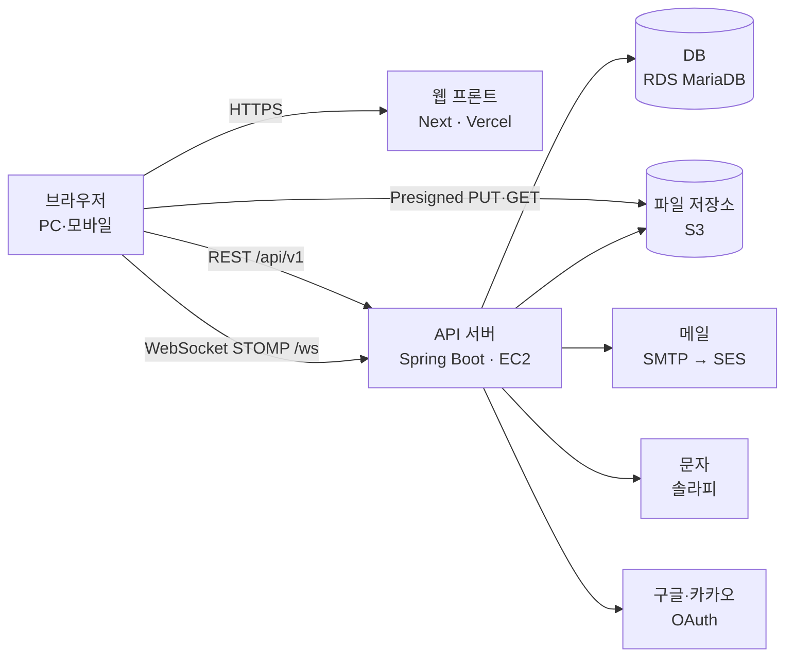

# 아키텍처

<!-- 전역 문서. 도메인 설계가 추가될 때마다 갱신한다 -->

## 구성도



- 브라우저는 프론트(`www.<도메인>`)에서 화면을 받고, API(`api.<도메인>`)를 직접 부른다. 도메인 이름: [OPEN-012]
- 두 주소가 같은 사이트(등록 도메인)라서 리프레시 토큰 쿠키(`SameSite=Strict`)와 WebSocket이 키트 설정 그대로 동작한다 〔2026-10-01〕 개인 도메인 구매로 결정. Vercel 프록시는 WebSocket을 넘기지 못한다

## 구성 요소

| 구성 요소 | 책임 | 기술 |
|---|---|---|
| 웹 프론트 | 화면, 다국어 문구, API·WebSocket 호출 | Next(App Router), shadcn/ui, TanStack Query, next-intl |
| API 서버 | REST API, 인증·인가, 업무 규칙, 실시간 전달, 예약 작업 | Spring Boot (백엔드 키트 골격) |
| 실시간 전달 | 메시지·알림 배지를 받는 회원에게 바로 밀어 준다 | Spring WebSocket + STOMP 내장 브로커 |
| 예약 작업 | 탈퇴 유예 경과 파기, 휴대폰 해시 보관 만료, 정지 기간 만료(SUSPENDED → ACTIVE, 알림), 모집 만료(OPEN → EXPIRED, 대기 신청 거절), 알림 보관 기간 경과 삭제, 붙지 않은 업로드 정리, 끊긴·만료된 로그인 세션과 리프레시 토큰 정리 | Spring `@Scheduled` (서버 한 대에서만 돈다). 상태 전이의 정본은 각 도메인 `_policy.md` |
| DB | 업무 데이터 | MariaDB 11.4 (운영 RDS, 로컬 Docker) |
| 파일 저장소 | 프로필 사진, 게시물·메시지 첨부 | 운영 S3, 로컬은 서버 디스크 (INT-STORAGE-001) |

## 기술 스택

| 영역 | 선택 | 근거 |
|---|---|---|
| 프론트엔드 | Next 16, TypeScript, Tailwind 4, shadcn/ui(base-nova, Base UI) | CON-001, 프론트 키트 |
| 서버 상태 | TanStack Query 〔2026-10-01〕 무한 스크롤 피드와 캐시 무효화를 직접 짜지 않는다 | 사용자 결정 |
| 다국어 | next-intl 〔2026-10-01〕 App Router 지원, 한국어·영어 문구 사전 | NFR-I18N-001, 사용자 결정 |
| 폼 | react-hook-form + zod 〔2026-10-01〕 | 사용자 결정 |
| 실시간 (프론트) | `@stomp/stompjs` | 실시간 방식 결정 |
| 백엔드 | Java 21, Spring Boot 3.5, JPA + QueryDSL, Flyway | CON-001, 백엔드 키트 |
| 실시간 (백엔드) | WebSocket + STOMP 〔2026-10-01〕 메시지·알림을 바로 전달한다. 서버 한 대라 내장 브로커로 충분하다. 서버를 늘리면 외부 브로커가 필요하다 | 사용자 결정 |
| DB | MariaDB 11.4 LTS | 백엔드 키트 |
| 호스팅 | 프론트 Vercel, 백엔드 EC2 한 대(Docker), DB RDS MariaDB, 파일 S3 〔2026-10-01〕 구성이 단순하고 WebSocket을 그대로 쓴다 | CON-002, 사용자 결정 |

## 모듈 경계와 의존 방향

백엔드 키트가 정한 레이어를 쓴다 (`backend/src/main/java/com/moa/`).

```text
api.controller → api.application → api.service → api.repository(reader·writer) → api.repository.jpa
common (응답·예외·보안·감사·설정·외부 연동 어댑터)은 어느 레이어든 쓸 수 있다
```

- 컨트롤러는 Application만, Application은 Service만, Service는 Reader·Writer만 부른다
- 강제: 키트의 `ArchitectureTest`(ArchUnit). 이유와 예외는 `conventions.md` 1.1
- 외부 연동(메일, 문자, 저장소, OAuth)은 `common`에 포트(인터페이스)와 어댑터를 두고, Service는 포트만 부른다. 어댑터는 설정으로 고른다
- 프론트는 화면(`app/`) → 앱 컴포넌트(`components/`) → API 모듈(`lib/api/`) 방향으로만 부른다. 상세는 `conventions.md` 3절

## UI

- 프론트 키트: `harness-psw-frontend` v0.8.0, 테마 rose, 프레임워크 Next 〔2026-10-01〕 가장 최근 태그. rose는 키트가 SNS·사진 피드용으로 고른 테마
  - 셸은 키트 커밋 `d1f5c50`(v0.8.0 다음, 모바일 하단 탭 바 설정 추가)의 사이드바형을 쓴다 〔2026-10-02〕 사용자 결정. 키트에 태그(v0.9.0)를 달면 이 줄을 태그로 바꾼다
- 테마 파일: `frontend/app/theme.css` (`frontend/app/globals.css`가 불러온다)
- 컴포넌트 코드: `frontend/components/ui/`, `frontend/hooks/use-mobile.ts`
- 셸: 사이드바형, 설정 왼쪽 · 아이콘만 남김 · 벽에 붙음 · 펼침 〔2026-10-01〕 메뉴(피드·메시지·파티·알림·프로필 등)가 많다. 목업 셸 `ui/kit/shell.js`
  - 모바일 메뉴: 하단 탭 바(`mobileNav: "tabbar"`) 〔2026-10-02〕 사용자 결정. SNS라 자주 쓰는 화면을 엄지로 바로 연다. 탭과 헤더 아이콘은 `ui/ia/README.md` 모바일 메뉴 절
- 셸 코드: `frontend/components/app-sidebar.tsx`, `frontend/components/mobile-tab-bar.tsx`, `frontend/app/layout.tsx` (구현 첫 화면 FR에서 만든다. 탭 바는 키트 playground `shells.tsx`의 `MobileTabBar`·`MobileActions`를 따른다)
- 위 경로는 공유 파일이다. 구현자가 FR 작업 중에 고치지 않는다

## 백엔드

- 백엔드 키트: `harness-psw-backend` v0.2.0, 프레임워크 springboot, 헬퍼 없음, 패키지 `com.moa` 〔2026-10-01〕 가장 최근 태그. 메일 헬퍼는 SMTP 설정을 관리자 API로 바꾸는 기능이라 REQ에 없는 관리 기능이 생겨 쓰지 않는다. 메일은 외부 연동 절의 어댑터로 보낸다
- 코드 루트: `backend/`
- DB 마이그레이션: `backend/src/main/resources/db/migration/`. 구현자는 새 파일만 추가하고 이미 있는 파일은 고치지 않는다. 프로젝트 파일은 `V2`부터
- 테스트 위치: `backend/src/test/`. `.claude/psw.conf`의 `PSW_TEST_GLOBS`에 넣는다
- 골격 테스트 조정: FR-MEM-002(로그인)에서 한다 (키트 APPLY.md "사용자 도메인에서 할 일")
  - 시스템 계정 시드를 만들고 `AUDIT_SYSTEM_ACTOR_ID`에 넣는다
  - 관리자 계정 한 명을 마이그레이션 시드로 만든다 (`admin/_policy.md` 관리자 계정 생성). 이메일과 BCrypt 해시는 Flyway 자리표시(`${admin_email}`, `${admin_password_hash}`)로 받고, 값은 배포 환경변수 `ADMIN_EMAIL`, `ADMIN_PASSWORD_HASH`에서 `spring.flyway.placeholders`로 넘긴다. 저장소에는 운영 값을 두지 않는다
    - local·test 프로필은 `application.yml`에 개발용 기본값(예: `admin@moa.local`과 개발용 비밀번호의 해시)을 둔다. 운영(prod) 프로필은 기본값 없이 시작할 때 값이 있는지 검증한다. 두 변수는 `backend/.env.example`에 적는다
  - 게임·모드·티어 초기값(`admin/_policy.md` 게임 목록 초기값)을 마이그레이션 시드로 넣는다. 코드는 특정 게임·티어 이름으로 분기하지 않고 정렬 순서만 쓴다
  - `AuthPrincipalLoader`를 구현하고, `support/TestAuthConfig.java`를 지우고 `AcceptanceTest`의 `@Import`에서 뺀다
  - `AuthTokenAcceptanceTest.login()`이 계정 행을 먼저 만들게 한다
  - 표시 이름의 `[auth-token-refresh]`는 `SEC-AUTH-004`로, `[auth-token-logout]`은 `FR-MEM-003`으로 바꾼다
- 골격 인증 보강 (로그인 세션): FR-MEM-002에서 한다. 내용은 `security.md` 토큰·세션
- 키트 문서 조각(`auth-token`) 대응 〔2026-10-01〕 같은 요구가 이미 승인된 REQ에 있어 새 FR을 만들지 않는다
  - 재발급(`fr-token-refresh`) → `SEC-AUTH-004` 로그인 유지 14일
  - 로그아웃(`fr-token-logout`) → `FR-MEM-003`
  - 조각의 "액세스 토큰은 서버에서 폐기하지 않는다"는 쓰지 않는다. 로그인 세션으로 즉시 끊는다 (`security.md`)

## 외부 연동

공통: 외부 호출은 `common`의 포트 뒤에 두고, 어댑터는 `application.yml` 설정으로 고른다. 키 값은 환경변수로만 받는다.

### 구글 로그인

- 근거: INT-GOOGLE-001, INT-GOOGLE-002
- 용도와 방향: 가입·로그인, 로그인 수단 연결. 우리 → 구글(인가 코드 교환), 구글 → 우리(리다이렉트 콜백)
- 인증: OAuth 2.0 / OpenID Connect, 클라이언트 ID·시크릿 (`GOOGLE_CLIENT_ID`, `GOOGLE_CLIENT_SECRET`)
- 흐름: 브라우저 → `api/v1/auth/oauth/google` → 구글 동의 → 콜백에서 서버가 코드 교환·ID 토큰 검증 → 리프레시 쿠키를 쓰고 프론트로 리다이렉트 → 프론트가 재발급으로 액세스 토큰을 받는다
- 계정 합치기: ID 토큰의 `email_verified`가 true일 때만 같은 이메일 계정에 합친다

| 작업 | 엔드포인트 | 타임아웃 | 재시도 | 멱등 키 |
|---|---|---|---|---|
| 코드 교환 | `oauth2.googleapis.com/token` | 5초 | 없음 | 인가 코드(한 번만 쓰인다) |

| 실패 | 처리 | 보상 |
|---|---|---|
| 동의 거부, 코드 교환 실패·타임아웃 | 로그인 화면으로 돌아가 실패를 알리고 다른 수단을 쓰게 한다 (FR-MEM-001·002 예외 흐름) | 없음 |
| `state` 불일치 | 거부한다 (CSRF) | 없음 |

- 테스트 환경: 구글 테스트 사용자(OAuth 동의 화면 테스트 모드), 키 준비 대기 (구현 착수 때 사용자가 발급)

### 카카오 로그인

- 근거: INT-KAKAO-001, INT-KAKAO-002, INT-KAKAO-003
- 용도와 방향: 구글과 같다
- 인증: OAuth 2.0, REST API 키·클라이언트 시크릿 (`KAKAO_CLIENT_ID`, `KAKAO_CLIENT_SECRET`)
- 계정 합치기: 사용자 정보의 이메일 인증 여부(`is_email_verified`)가 참일 때만 합친다
- 이메일 미동의: 이메일 없이 돌아오면 가입을 이메일 인증 단계로 이어 간다 (INT-KAKAO-003)

| 작업 | 엔드포인트 | 타임아웃 | 재시도 | 멱등 키 |
|---|---|---|---|---|
| 코드 교환 | `kauth.kakao.com/oauth/token` | 5초 | 없음 | 인가 코드 |
| 사용자 정보 | `kapi.kakao.com/v2/user/me` | 5초 | 1회 | 조회라 해당 없음 |

| 실패 | 처리 | 보상 |
|---|---|---|
| 동의 거부, 코드 교환·사용자 정보 실패 | 구글과 같다 | 없음 |

- 테스트 환경: 카카오 개발자 앱 테스트 계정, 키 준비 대기

### 메일 발송

- 근거: INT-MAIL-001, INT-MAIL-002
- 용도와 방향: 가입 이메일 인증, 비밀번호 재설정 링크. 우리 → 메일 서버
- 인증: SMTP 계정 (`MAIL_HOST`, `MAIL_PORT`, `MAIL_USERNAME`, `MAIL_PASSWORD`)
- 어댑터: `psw.mail.provider` = `smtp`(처음) / `ses`(안정화 후) / `log`(테스트·로컬, 본문을 로그로). 기능 코드는 포트 `MailSender`만 부른다
- 로컬: Docker Compose의 Mailpit으로 SMTP를 받는다 (`http://localhost:8025`)

| 작업 | 엔드포인트 | 타임아웃 | 재시도 | 멱등 키 |
|---|---|---|---|---|
| 메일 보내기 | SMTP 서버 | 연결 5초, 전송 10초 | 없음 (사용자가 다시 보내기) | 없음 |

| 실패 | 처리 | 보상 |
|---|---|---|
| 연결 실패·타임아웃·거부 | 요청에 실패 응답을 주고 화면이 실패와 다시 보내기를 보여 준다. 다시 보내기는 60초에 한 번 | 발급한 인증 링크를 쓸 수 없게 한다 |

- 테스트 환경: Mailpit(로컬), 운영 SMTP 계정 준비 대기

### 문자 발송

- 근거: INT-SMS-001, INT-SMS-002
- 서비스: 솔라피 〔2026-10-01〕 개인도 발신번호 등록이 쉽고 단가가 낮고 자바 SDK가 있다
- 용도와 방향: 가입 휴대폰 인증 번호. 우리 → 솔라피
- 인증: API 키·시크릿(HMAC 서명), 발신번호 (`SOLAPI_API_KEY`, `SOLAPI_API_SECRET`, `SOLAPI_SENDER`)
- 어댑터: `psw.sms.provider` = `solapi`(운영) / `log`(개발·테스트. 인증 번호를 로그로 출력, INT-SMS-001)

| 작업 | 엔드포인트 | 타임아웃 | 재시도 | 멱등 키 |
|---|---|---|---|---|
| 문자 보내기 | 솔라피 메시지 발송 API | 연결 3초, 응답 5초 | 없음 (중복 발송 방지) | 없음 |

| 실패 | 처리 | 보상 |
|---|---|---|
| 타임아웃·오류 응답 | 실패 응답, 화면이 실패와 다시 보내기를 보여 준다. 다시 보내기 제한은 INT-SMS-002 | 발급한 인증 번호를 무효로 한다 |

- 테스트 환경: 개발은 `log` 어댑터. 운영 키·발신번호 등록 준비 대기

### 파일 저장소

- 근거: INT-STORAGE-001
- 방식: Presigned URL 직접 업로드 〔2026-10-01〕 사용자 결정. 큰 동영상(100MB)이 API 서버를 거치지 않는다
- 용도와 방향: 브라우저 → 저장소(업로드·조회), 우리 → 저장소(URL 발급, 확인, 삭제)
- 인증: 운영은 EC2 인스턴스 역할(IAM)로 S3에 접근한다. 접근 키를 코드나 환경변수에 두지 않는다
- 흐름
  1. 프론트가 파일 종류·크기·용도로 업로드를 요청한다 → 서버가 형식·용량을 검사하고 업로드 키와 PUT URL(유효 10분)을 준다
  2. 브라우저가 PUT URL로 바로 올린다
  3. 프론트가 게시물·메시지·프로필 저장 때 업로드 키를 함께 보낸다 → 서버가 객체의 실제 크기·형식과 동영상 길이(60초)를 확인한 뒤 붙인다. 확인에 실패하면 V001
  4. 붙지 않은 업로드는 하루 뒤 지운다 (예약 작업)
- 조회: 비공개 계정·차단 규칙이 있어 버킷은 비공개로 두고, 조회도 서버가 서명한 GET URL로 한다
- 어댑터: `psw.storage.provider` = `s3` / `local`. `local`은 API 서버가 같은 모양의 PUT·GET 주소(`/api/v1/files/local/...`, local 프로필에서만 켠다)를 흉내 내고 서버 디스크에 저장한다
- 형식·용량 규칙의 정본: `docs/req/functional/feed/_policy.md` 첨부 규칙, `member/_policy.md` 프로필 사진

| 작업 | 엔드포인트 | 타임아웃 | 재시도 | 멱등 키 |
|---|---|---|---|---|
| URL 발급 | (서버 안에서 서명) | 해당 없음 | 해당 없음 | 업로드 키(UUID) |
| 확인·길이 검사 | S3 HeadObject, GetObject(앞부분) | 5초 | 1회 | 업로드 키 |
| 삭제 | S3 DeleteObject | 5초 | 예약 작업이 다음 회차에 다시 | 업로드 키 |

| 실패 | 처리 | 보상 |
|---|---|---|
| 브라우저 업로드 실패 | 화면이 실패를 알리고 다시 올리게 한다 | 없음 (붙지 않은 업로드는 정리된다) |
| 확인 실패 (크기·형식·길이 위반) | 저장을 V001로 거절한다 | 그 객체를 지운다 |

- 테스트 환경: 로컬 `local` 어댑터, 운영 S3 버킷 준비 대기

## 배포 단위

| 단위 | 대상 | 비고 |
|---|---|---|
| 웹 프론트 | Vercel (`frontend/`) | `www.<도메인>` |
| API 서버 | EC2 한 대, Docker 이미지 (`backend/`) | `api.<도메인>`, HTTPS 종료는 서버 앞단(리버스 프록시)에서. WebSocket 업그레이드를 통과시킨다 |
| DB | RDS MariaDB 11.4 | API 서버만 접근한다 (보안 그룹) |
| 파일 | S3 버킷 (비공개) | EC2 인스턴스 역할로 접근 |

- 시크릿 저장소: (구현 준비에서 정한다)

## 적용 요구사항

| ID | 방법 |
|---|---|
| NFR-CAP-001 | 서버 한 대 + RDS로 동시 100명을 처리한다. 피드는 커서 페이징, 첨부는 저장소 직접 업·다운로드로 서버 부하를 줄인다. 확인은 부하 테스트 |
| NFR-ENV-001 | 반응형 웹 한 벌. 데스크톱은 사이드바, 모바일 폭은 하단 탭 바와 서랍 (`ui/ia/README.md` 모바일 메뉴 절). 화면 규칙은 `ui/ui-rules.md` |
| NFR-I18N-001 | 화면 문구는 next-intl 사전(`ko`, `en`)에만 둔다. 서버 오류 메시지는 화면이 오류 코드로 번역한다. 시각은 서버가 UTC로 저장·응답하고 화면이 KST로 보여 준다 |
| SEC-AUTH-001, 003, 004 | `security.md` |
| INT-* | 외부 연동 절 |
| DAT-RET-001, 002 | 예약 작업이 하루 한 번 탈퇴 유예(30일)가 지난 계정을 파기하고, 휴대폰 번호 해시만 30일 더 둔다. 익명화는 탈퇴 때 즉시 (작성자 표시를 "탈퇴한 회원"으로) |

## 금지·제약

- NEVER: Service에서 외부 SDK(S3, 솔라피, SMTP)를 직접 부르지 않는다. 포트를 부른다
- NEVER: S3 버킷을 공개로 열지 않는다
- 서버는 한 대로 운영한다. 늘리려면 STOMP 외부 브로커와 예약 작업 잠금이 먼저 필요하다
