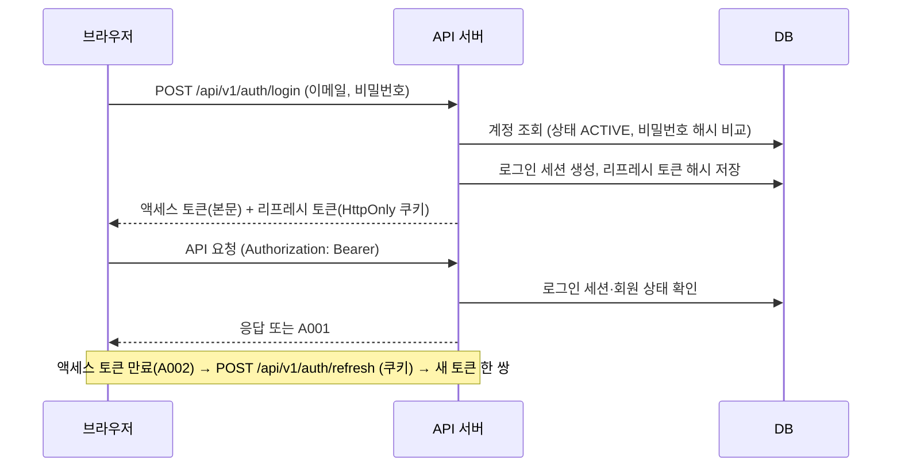

# 보안 설계

<!-- 전역 문서. refs에 반영한 SEC ID를 적는다 -->

## 인증 흐름

이메일+비밀번호 로그인. 구글·카카오는 `architecture.md` 외부 연동 절의 흐름으로 인증한 뒤 같은 발급 단계를 탄다.

- 가입 인증: 이메일 인증 링크(30분, 한 번), 휴대폰 인증 번호(6자리, 3분, 5회 입력). 값은 `SEC-AUTH-003`
  - 링크·번호는 원문을 저장하지 않고 해시로 저장한다. 쓰면 바로 무효로 한다
- 소셜 로그인은 `state` 값으로 CSRF를 막고, 합치기는 제공자가 인증된 이메일로 알려 준 경우만 한다 (INT-GOOGLE-002, INT-KAKAO-002)
- 로그인 실패 잠금은 두지 않는다 (`docs/req/security/authentication.md`)

## 인가 모델

- 역할별 권한의 정본: `docs/req/actors.md`
- 역할 코드: `MEMBER`(회원), `ADMIN`(관리자). 비회원은 인증 없음
- 검사 위치
  - 역할: 컨트롤러 메서드의 `@PreAuthorize("hasRole('...')")`. 로그인 없이 부를 API는 `@PermitAll`
  - 조건부 권한(△: 작성자만, 방장만, 친구만, 차단 관계 아님 등): Service에서 검사하고 A005 또는 업무 오류로 거절한다
  - 찾을 수 없는 회원 규칙(탈퇴·정지·나를 차단, `member/_policy.md`)에 걸린 회원과 그 회원의 게시물·모집은 R001로 응답한다 (존재를 드러내지 않는다)
  - 관리자는 예외로 숨긴 게시물·댓글, 비공개 계정의 게시물·목록, 탈퇴·정지 회원의 프로필과 게시물을 볼 수 있다(원문 보기). 〔2026-10-02〕 비공개 포함 사용자 결정. 응답에 숨김·정지·탈퇴 상태를 함께 준다 (`member/_policy.md`, `feed/_policy.md`, FR-ADM-001 AC-1)
  - 비공개 계정은 프로필 자체는 비공개 안내와 함께 보여 주고(FR-MEM-005 E1), 게시물·팔로워·팔로잉 목록만 막는다(FR-REL-003 E1). 목록 요청은 오류 없이 항목 없는 결과와 비공개 표시로 응답한다 (FR-REL-003 AC-1)
- WebSocket: STOMP `CONNECT` 프레임의 `Authorization` 헤더를 REST와 같은 방식으로 검사한다. 구독은 자기 사용자 대상(`/user/queue/...`)만 허용한다

## 토큰·세션

| 항목 | 방식 | 근거 |
|---|---|---|
| 액세스 토큰 | JWT(HS256), 응답 본문으로 받아 프론트 메모리에만 둔다 (localStorage에 두지 않는다) | 백엔드 키트 |
| 리프레시 토큰 | HttpOnly·Secure·`SameSite=Strict` 쿠키, 경로 `/api/v1/auth`. DB에는 해시만, 쓸 때마다 회전, 재사용하면 그 회원 토큰 전부 폐기 | 백엔드 키트 |
| 만료 | 액세스 15분, 리프레시 14일 (로그인 유지 기간). 설정 `JWT_ACCESS_TOKEN_TTL`, `JWT_REFRESH_TOKEN_TTL` | SEC-AUTH-004 |
| 즉시 끊기 | 로그인 세션 (아래) | SEC-AUTH-004 |
| 비밀번호 저장 | BCrypt (솔트 포함 단방향) | SEC-AUTH-005 |
| 비밀번호 정책 | 서버와 화면이 같은 규칙으로 검사한다. 값은 `SEC-AUTH-002` | SEC-AUTH-002 |

### 로그인 세션으로 즉시 끊기

〔2026-10-01〕 키트 골격은 액세스 토큰을 서명만 보고 통과시켜 최대 15분 동안 유효하다. SEC-AUTH-004의 "즉시 끊는다"를 지키려고 요청마다 세션을 확인한다. 사용자 결정
〔2026-10-02〕 회원 단위 토큰 버전에서 기기 단위 로그인 세션으로 바꿨다. 토큰 버전으로는 로그아웃한 기기만 끊을 수 없고(FR-MEM-003), 비밀번호를 바꾼 지금 기기를 살릴 수 없다(FR-MEM-010). 설계 검토 지적

- 로그인할 때마다 로그인 세션을 하나 만든다 (기기·브라우저 하나에 하나). 리프레시 토큰은 그 세션에 속하고, 재발급해도 세션은 같다
- 액세스 토큰에 세션 ID를 클레임 `sid`로 넣는다
- 인증 필터가 요청마다 세션과 회원을 읽는다. 세션이 없거나 끊겼거나, 회원이 ACTIVE가 아니면 A001로 거절한다
  - 키 조회 한 번이라 동시 100명 규모에서 부담이 작다. 캐시는 두지 않는다 (캐시하면 즉시가 아니게 된다)
- 끊는 범위

| 사건 | 끊는 세션 | 근거 |
|---|---|---|
| 로그아웃 | 그 기기의 세션 | FR-MEM-003, SEC-AUTH-004 |
| 비밀번호 변경 | 지금 기기를 뺀 모든 세션 | FR-MEM-010 |
| 비밀번호 재설정 | 모든 세션 | FR-MEM-009 |
| 제재 (SUSPENDED) | 모든 세션 | FR-ADM-002, SEC-AUTH-004 |
| 탈퇴 (WITHDRAWN) | 모든 세션 | FR-MEM-008, SEC-AUTH-004 |

- 세션을 끊으면 그 세션의 리프레시 토큰도 함께 폐기한다
- WebSocket: STOMP 연결도 세션 ID를 가진다. 세션을 끊을 때 그 세션의 STOMP 연결을 서버가 닫는다
- 구현: 세션 발급(로그인 세션 생성, `sid` 클레임, 리프레시 토큰 연결)은 FR-MEM-001에서 한다(`architecture.md` 구글 로그인 구현 범위). 요청마다 하는 확인은 골격에 포트(예: `AuthSessionChecker`)를 더해 `JwtAuthenticationFilter`가 부르고, 회원 도메인이 구현한다. FR-MEM-002에서 한다 〔2026-10-04〕 사용자 결정

## 데이터 보호

| 대상 (테이블.컬럼) | 보호 방식 | 근거 |
|---|---|---|
| 회원.비밀번호 | BCrypt 해시 | SEC-AUTH-005 |
| 회원.휴대폰 번호 | 원문은 AES-GCM으로 암호화해 저장(관리자 화면 표시용), 중복 검사는 HMAC-SHA256 값으로 한다. 관리자 화면은 가운데 4자리를 가린다 | SEC-PRIV-001, SEC-PRIV-002. 〔2026-10-03〕 사용자 확인 |
| 파기된 회원의 휴대폰 번호 | HMAC 값만 30일 더 보관하고 지운다 | DAT-RET-002 |
| 회원.이메일, 생년월일 | 평문 저장. 본인·관리자 응답에만 넣는다 | SEC-PRIV-002 |
| 인증 링크·인증 번호·리프레시 토큰 | SHA-256 해시 | SEC-AUTH-003, 키트 |
| 첨부 파일 | 비공개 버킷 + 서버가 서명한 짧은 GET URL | INT-STORAGE-001 |

- 응답 분리: 다른 회원에게 가는 응답 DTO에는 이메일·생년월일·휴대폰 번호 필드를 두지 않는다. 본인용·관리자용 DTO를 따로 둔다 (SEC-PRIV-002)
- 암호화 키(`PII_ENCRYPTION_KEY`), HMAC 키(`PII_HMAC_KEY`)는 환경변수로만 받는다. 키를 바꾸면 기존 값을 다시 암호화하는 작업이 필요하다

## 감사 로그

모든 테이블의 생성·수정·삭제 행위자와 시각은 키트 감사 컬럼으로 남는다. 그 밖에 아래를 로그(서버 로그, traceId 포함)로 남긴다.

| 이벤트 | 기록 항목 | 근거 |
|---|---|---|
| 로그인 성공·실패 | 회원 ID 또는 입력 이메일, 수단, IP, 결과 | SEC-AUTH-001 |
| 세션 끊기 | 회원 ID, 세션 ID, 사유(로그아웃·비밀번호 변경·재설정·제재·탈퇴) | SEC-AUTH-004 |
| 리프레시 토큰 재사용 감지 | 회원 ID, IP | 키트 |
| 관리자 조치 (신고 처리, 제재·해제, 계정 복구, 게임 목록 변경) | 관리자 ID, 대상, 조치, 사유 | FR-ADM-001~005 |

- NEVER: 로그에 비밀번호, 토큰, 인증 번호, 휴대폰 번호 원문을 남기지 않는다 (문자 `log` 어댑터의 인증 번호 출력은 개발 프로필에서만)

## 금지·제약

- NEVER: 비밀번호·인증 번호·토큰 원문을 DB나 로그에 남기지 않는다
- NEVER: 액세스 토큰을 localStorage·sessionStorage·쿠키에 두지 않는다
- NEVER: 다른 회원용 응답에 개인정보 필드를 넣지 않는다
- 운영에서 문자 `log` 어댑터와 저장소 `local` 어댑터를 켜지 않는다 (시작할 때 프로필로 검사한다)
