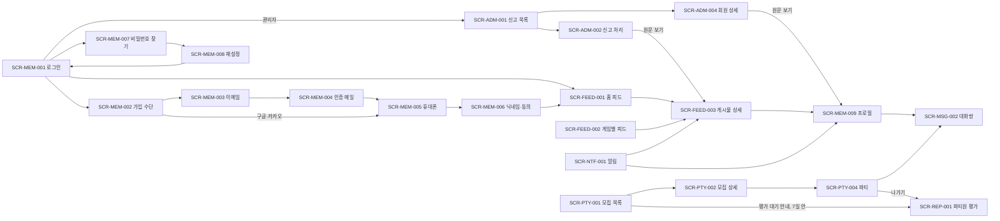

# 정보 구조 (IA)

<!-- 색인·메뉴·흐름만 둔다. 화면 목록은 도메인별 파일(<domain>.md)이 소유한다 (harness-psw 4.4) -->

## 도메인 색인

| 도메인 | 화면 목록 | 화면 수 |
|---|---|---|
| MEM 회원 | `member.md` | 16 |
| REL 관계 | `relation.md` | 5 |
| FEED 피드 | `feed.md` | 8 |
| MSG 메신저 | `message.md` | 3 |
| PTY 파티 | `party.md` | 8 |
| REP 평판 | `reputation.md` | 1 |
| NTF 알림 | `notification.md` | 1 |
| ADM 관리 | `admin.md` | 7 |

- 시안: `../screens/<domain>/<screen>.html`, 화면당 한 장
- MAT(매칭)는 MVP 이후라 화면을 아직 두지 않는다

## 셸 없는 화면

로그인 전 단계 화면은 셸 없이 가운데 카드 하나로 그린다.

- SCR-MEM-001 (로그인)
- SCR-MEM-002 ~ SCR-MEM-006 (회원가입 단계)
- SCR-MEM-007, SCR-MEM-008 (비밀번호 찾기·재설정)

## 메뉴 계층

```text
홈                       회원
게임별 피드               모두 (게임 선택은 화면 안 탭)
검색                     모두
메시지                   회원
파티                     모두
알림                     회원 (안 읽은 수 배지)
친구                     회원
├─ 친구 목록
└─ 팔로우 요청            비공개 계정 회원만 (FR-REL-002 △)
프로필                   회원 (내 프로필)
설정                     회원, 관리자
관리                     관리자 (관리자 콘솔)
├─ 신고
├─ 회원
└─ 게임
```

- 셸(`../kit/shell.js`)의 메뉴는 이 계층과 같게 적는다. 메뉴를 바꿀 때는 여기를 먼저 고친다
- 셸은 하나다. 역할에 따라 메뉴 항목을 숨긴다 (오른쪽 열). 권한의 정본은 `docs/req/actors.md`
  - 비회원: 게임별 피드, 검색, 파티만 보이고, 사이드바 아래에 로그인·회원가입 버튼을 둔다
  - 관리자: 관리자 콘솔만 본다. 메뉴는 관리(신고·회원·게임)와 설정뿐이다 〔2026-10-02〕 사용자 결정 (FR-MEM-002)
    - 로그인하면 신고 목록(SCR-ADM-001)으로 간다. `/`와 `/admin`도 신고 목록으로 보낸다
    - 사용자 화면(게시물, 프로필)은 신고 상세·회원 상세의 "원문 보기"로만 연다. 숨긴 게시물과 정지·탈퇴 회원도 상태 표시와 함께 보인다 (`member/_policy.md`, `feed/_policy.md`). 그 화면에는 회원 행동 버튼을 그리지 않는다 (`ui-rules.md`)
  - 화면 목록의 접근 역할에 관리자가 있는 사용자 화면(게임별 피드, 해시태그, 검색, 모집 목록, 팔로워 목록)은 `actors.md` 권한(○)을 그대로 적은 것이다. 관리자 콘솔에는 그 화면으로 가는 메뉴가 없다
- 게임별 피드의 게임 탭은 관리자 게임 목록(FR-ADM-004)에서 온다. 처음 게임은 리그 오브 레전드, 오버워치, 배틀그라운드
- 언어 전환(한국어·영어)은 비회원은 셸 아래쪽, 회원·관리자는 설정에서 한다 (NFR-I18N-001)
- 모바일 폭(768px 미만)에서는 사이드바가 서랍으로 접히고 헤더의 메뉴 버튼으로 연다 (NFR-ENV-001)

## 화면 흐름


